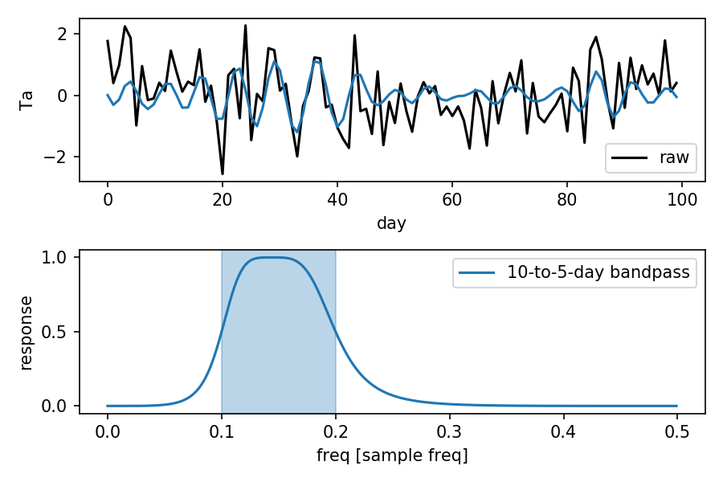

# xfilter
Wrap the forward-backward Butterworth filter from the scipy package so that it can be easily used by xarray.DataArray. 

## usage 

		import xarray as xr
		import numpy as np
		import matplotlib.pyplot as plt
		import xfilter         

		np.random.seed(0)
		da = xr.DataArray(np.random.randn(100), dims='day', name='Ta', attrs={'units': 'degC'})

		fig, axes = plt.subplots(2, 1)
		ax = axes[0]
		da.plot(label='raw', color='k', ax=ax)
		da.filter.bandpass([1/10, 1/5]).plot(ax=ax)
		ax.legend(loc='lower right')
		
		ax = axes[1]
		xfilter.bandpass_response([1/10, 1/5]).plot(label='10-to-5-day bandpass', ax=ax)
		ax.axvspan(1/10, 1/5, alpha=0.3, color='C0')
		ax.legend()

## notebook example
 * [lowpass, highpass and bandpass](https://nbviewer.jupyter.org/github/wy2136/xfilter/blob/master/example/xfilter_example.ipynb)
